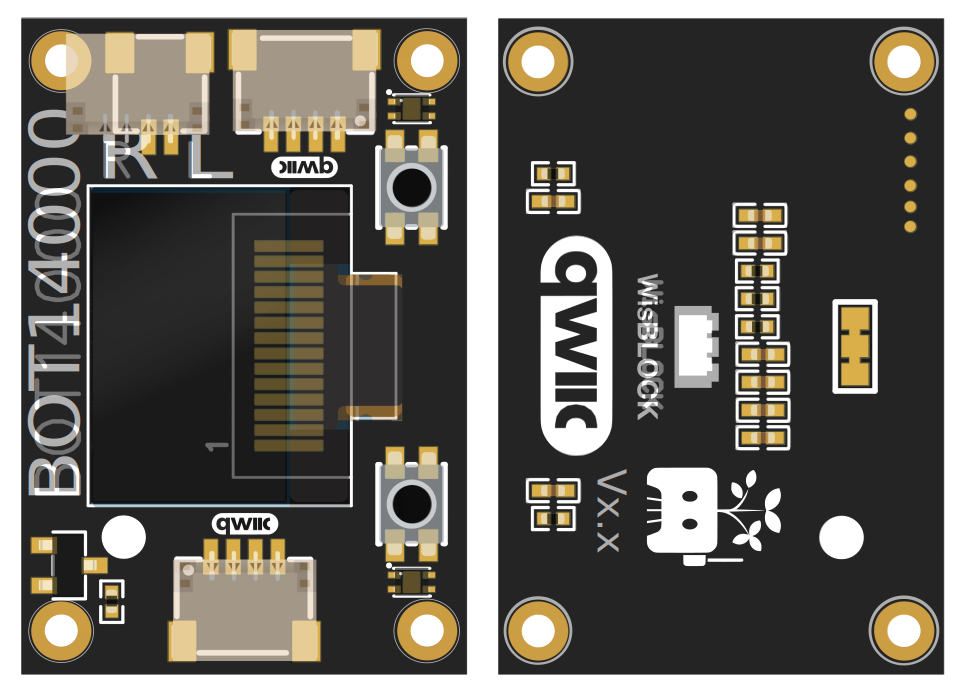

# BOT14000

The **BOT14000** is a versatile WisBlock-compatible module designed for seamless integration into your IoT and embedded projects. Engineered for reliability and ease-of-use, the BOT14000 extends your system’s capabilities with robust features and simple connectivity.

- **WisBlock compatible** for rapid prototyping and deployment
- Compact form factor for space-constrained applications
- Designed for straightforward integration with WisBlock Base and Core modules

For detailed technical documentation, specifications, and advanced integration guides, please visit our [documentation website](https://docs.example.com/BOT14001).

---

**Example code for the BOT14000 is available in this folder.**