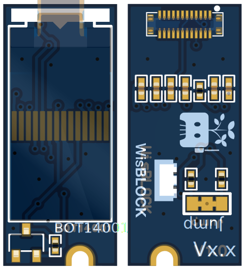

# BOT14001 OLED Display Module

The **BOT14001** is a compact 23mm WisBlock sensor module featuring a crisp 88×48 pixel OLED display, powered by the CH1115 controller. It connects via I2C (0x3C address), is optimized for low power use, and is fully compatible with the WisBlock ecosystem.

- **Display:** 88x48 OLED, CH1115 controller, I2C interface
- **Form Factor:** Standard 23mm WisBlock sensor slot
- **Low Power:** ~20mA active, <1μA sleep, 3.3V operation
- **Plug & Play:** Integrated pull-ups (jumper configurable)
- **Typical Uses:** IoT dashboards, status screens, portable and wearable displays

For full documentation, technical details, and quickstart guides, visit the [official docs portal](https://docs.example.com/BOT14001).

_Example code and hardware images can be found in this folder and in `/examples/BOT14001/`._