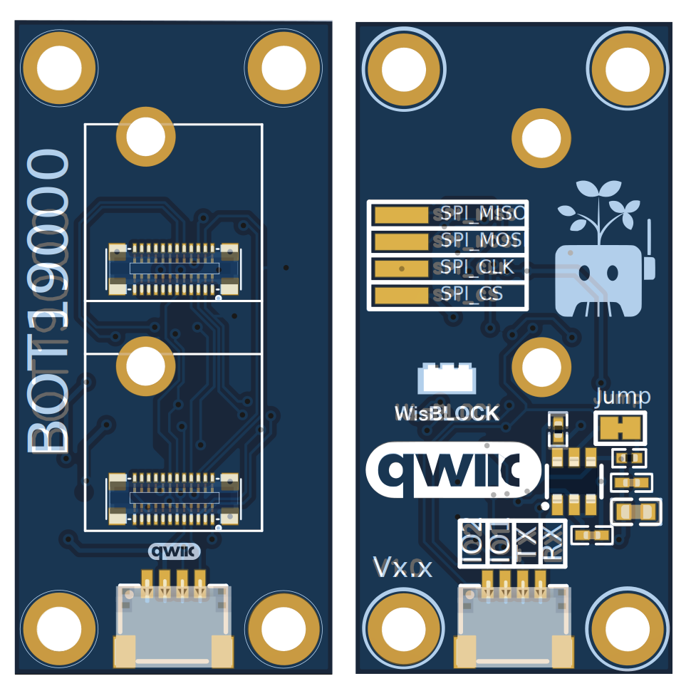

# BOT19000 Qwiic-Powered Baseboard

The **BOT19000** is a Qwiic-powered baseboard featuring dual WisBlock-compatible sensor slots with identical 24-pin pinouts. Powered entirely via Qwiic connector (226mA max), it provides the same VDD/3V3_S and 3V3 power architecture as WisBlock Base boards, enabling seamless migration of existing WisBlock projects.

- **Dual Sensor Slots:** 100% WisBlock 24-pin compatible (Slots A & B)
- **Qwiic-Powered:** 226mA total system budget via standard Qwiic connector
- **Power Management:** TPS27082LDDCR load switch for efficient 3V3_S control
- **Default Configuration:** IO2 jumper closed (3V3_S always powered)
- **Advanced Control:** Cut jumper to enable software-controlled power switching via IO2
- **Multiple Interfaces:** I2C, UART (Slot A), GPIO, plus additional SPI pads

**Power Control Options:**
- **Jumper Closed (Default):** 3V3_S always powered - simple plug-and-play operation
- **Jumper Cut:** IO2 pin controls 3V3_S rail - enables advanced power management for battery applications

For complete specifications, WisBlock migration guides, and power budget planning, visit the [official docs portal](https://docs.example.com/BOT19000).